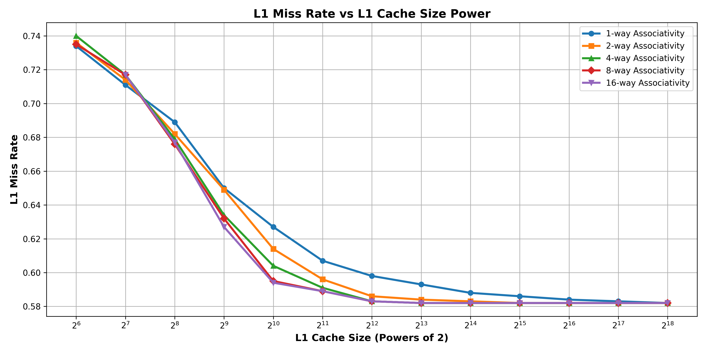

# Cache Simulator

A C++ implementation of a multi-level cache simulator that models the behavior of CPU caches with configurable parameters and policies.

## Features

- Multi-level cache simulation
- Configurable cache parameters:
  - Number of caches
  - Cache size
  - Associativity
  - Block size
  - Replacement policies (LRU and RAND)
  - Write policies (WTWA, WTNA, WBWA, WBNA)
- Statistics tracking
- Visualization script for results

## Building the Project

The project uses CMake for building. To build the project:

First install CMake
```bash
mkdir build
cd build
cmake ..
make
./advanced_cache_simulator
```

## Usage

### Running Simulations

1. Configure your cache parameters in `custom_setup.txt`
2. Indicate which trace you would like to run (1-3)

### Available Traces

The project includes several trace files for testing:
- 1. `trace1.txt`: Small trace
- 2. `trace2.txt`: Medium trace
- 3. `trace3.txt`: Large trace

### Visualizing Results

The project includes a Python script that generates graphs from simulation results:

`python visualize_results.py`

This will generate graphs in the `graphs/` directory showing:
- Miss rate vs. cache size
- Miss rate vs. block size

Results from testing:

#### Miss Rate vs Cache Size


#### Miss Rate vs Block Size


